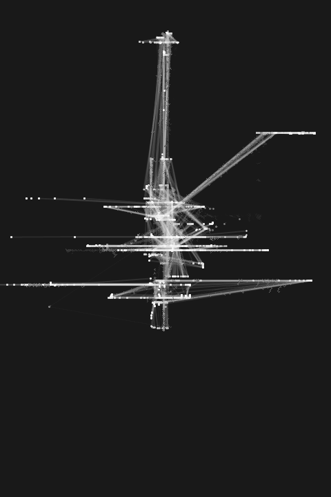

 
[](https://git.io/typing-svg)

<!---
Show profile views
-->
<p align="center">
  
</p> <br>

<p>
 

```
vasupatelll@github
-------------------------
🏫 Drexel University, Business Analysis in grad
📜 BBA with Data Science in undergrad, keen learner of Statistics

☁️ Multi-cloud platforms (GCP, Azure)
💫 Built event-driven pipelines processing multi-hop data
✏️ Currently overseeing data manager via TCP/IP server at The Commons XR

🏃‍♀️ My daily operation looks like:
    |- data migration / automation / LLM integration
```
</p>

<br>

<!--START_SECTION:waka-->


<!--START_SECTION:readme-stats-->


<!--END_SECTION:readme-stats-->


[](https://github.com/ashutosh00710/github-readme-activity-graph)
